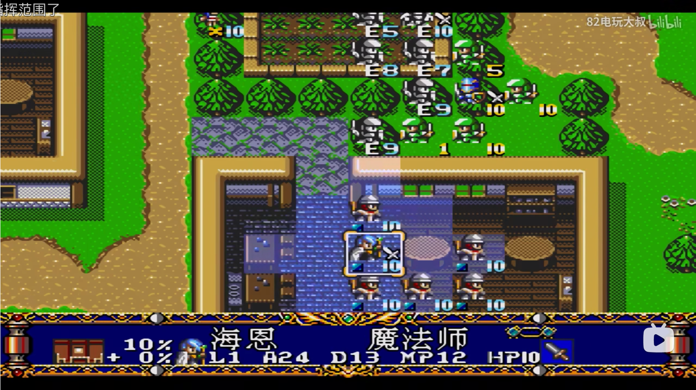
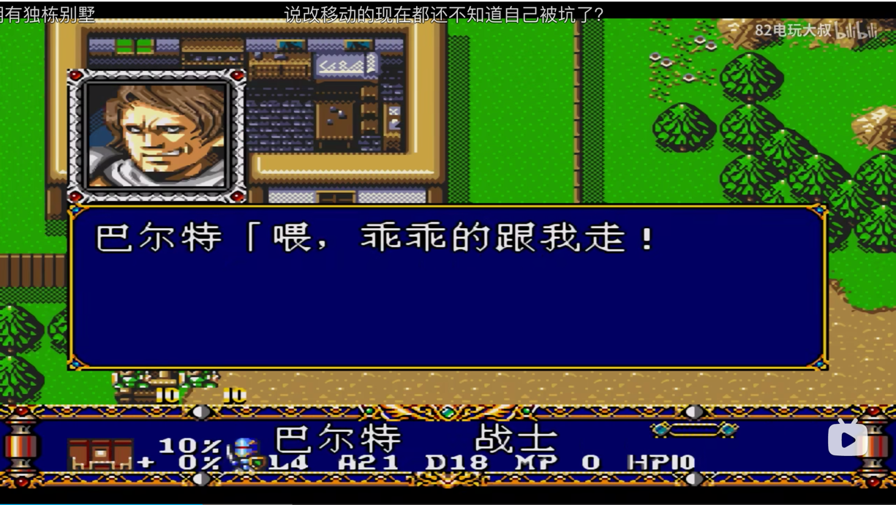
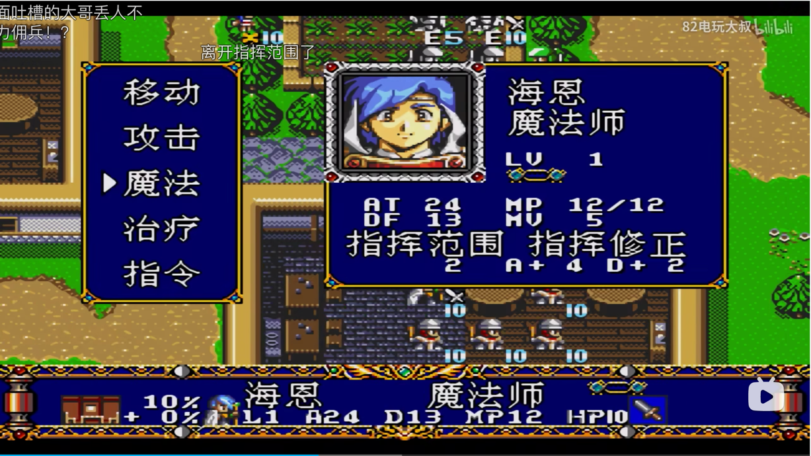
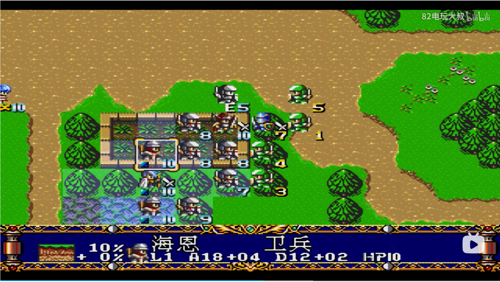

### 基础属性
HP,MP,ATK,DEF,体力值系统(每回合恢复一部分，用于移动，
也可以用作其他的，有最大值) 
普通攻击距离，技能距离，移动在各个格子上的消耗(都受装备影响) 
上面的属性都受装备影响
### 地形
影响移动的距离，是否可以穿越，还有各种加成(通过回调方法实现，装备也是)

### 对话剧情

每次显示一屏幕，打字机效果，回车跳过(先补完文本，再跳过)，
一屏显示不完，重复显示
### 克制关系
先采用简单的，剪刀，石头，布方式 
克制方攻击被克制方，攻击加0.5，对方防御减半 
被克制方攻击克制方，攻击减半，对方防御加0.5 
其他情况无事发生
### 物品
恢复，各种状态药水(有回合限制的技能，监听回合数，会自动移除)，
传送
### 操作

移动(每回合多次，不消耗完体力即可)，攻击(每回合一次)，技能(每回合一次消耗MP)，
物品(每回合一次)(后面3种一回合仅能选一次)(特殊的地点还可以选择特殊效果， 例如开炮)
### 技能
被动技能自发生效，不询问，主动技能必须手动触发，减小难度，
被动就是各个阶段的监听，除了基础伤害，还有各种加成
### 依旧采用人物与技能解耦的方式
提前配置好人物，技能，与地图数据 
技能区分buff与debuff集合，方便进行驱散(还有些效果具有不
可驱散的特性)光环类技能在移动后进行重新分配，一些特殊事件
需要进行全局通知，方便其他技能进行影响，技能可用状态管理
可能受其他技能影响，无法使用主动技能，技能不设置优先级，
通过修改传递的参数表达效果(例如直接无效参数)，护卫技能，
代替周围一定范围内的人抵挡伤害(改变攻击的目标)，各种状态
也是技能效果
### UI

下方显示简略信息，选择人物，显示人物的，否则显示地形的，
人物左边显示是否行动，右边显示剩余HP
### 注意
刚开始，采用全部自己手动操作的方式没有AI(但是还是要分敌我)
### 地形
暂定6中地形 
河流，森林，丘陵，城墙，沙漠，草地
### 大小
格子大小  32 * 32 
地图大小  1280 * 736(最后一格空着因为屏幕最低是光标处介绍
无法显示内容) 实际单元格 40 * 22 
视野大小  640 * 384
下方占用2行格子